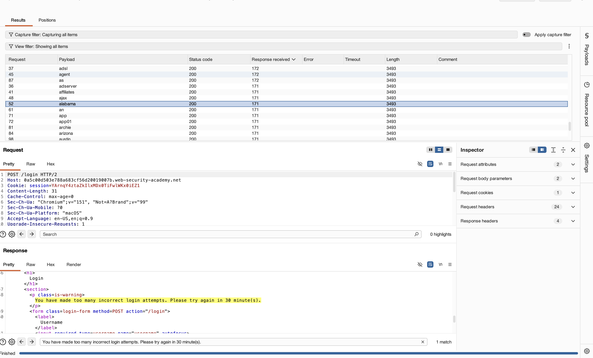
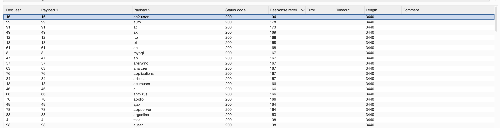

# Lab Write-up: Username Enumeration via Response Timing & IP Rate-Limit Bypass

## Executive Summary

* **Vulnerability Class:** Time-Based Side-Channel & HTTP Header-Based Rate-Limit Bypass
* **Target Vector:** `POST /login` (`X-Forwarded-For` header & timing differences)
* **Impact:** User Account Enumeration & Credential Brute-Force
* **Status:** Solved

---

## Vulnerability Overview

The target application incorporates an authentication endpoint (`POST /login`) protected by an automated IP-based rate-limiting mechanism. However, the backend improperly trusts client-supplied HTTP headers (`X-Forwarded-For`), allowing an attacker to spoof their client IP address and completely circumvent the rate-limiting control.

Additionally, the authentication logic exhibits a measurable timing side-channel. When processing login requests, valid usernames trigger CPU-intensive password operations (such as password hashing), causing a distinct response time delay compared to invalid usernames. Evaluating this time differential functions as an oracle to confirm valid accounts.

---

## Technical Methodology

### 1. Initial Rate-Limit Discovery & Bypass Verification

To evaluate the target's brute-force defenses, initial automated requests were issued to the login endpoint:

* **Baseline Test:** Automated password attempts against candidate usernames.
* **Result:** The application dropped connections and returned connection timeouts, confirming an active IP-based rate-limiting mechanism.
 <figure>
  
  <figcaption><em>Figure 1: Initial automated login attempts triggering the backend rate-limiting control, returning an explicit IP block message ("You have made too many incorrect login attempts").</em></figcaption>
</figure>

* **Header Bypass Test:** Added the `X-Forwarded-For` header to the HTTP request payload:
```http
POST /login HTTP/1.1
Host: target.web-security-academy.net
X-Forwarded-For: 1.2.3.4
```


* **Result:** Modifying the `X-Forwarded-For` header value reset the backend rate-limiting counter, verifying that client identification relied on client-controlled HTTP headers rather than network-layer socket metadata.

---

### 2. Time-Based Username Enumeration Strategy

To isolate valid user accounts, timing differentials between valid and invalid usernames were evaluated using an amplified password payload.

* **Amplification Payload Setup:**
Passing a long string (~100 characters) in the password field forces the backend hashing algorithm to execute additional computational cycles when a valid username is provided:
```http
username=§candidate_user§&password=aaaaaaaaaaaaaaaaaaaaaaaaaaaaaaaaaaaaaaaaaaaaaaaaaaaaaaaaaaaaaaaaaaaaaaaaaaaaaaaaaaaaaaaaaaaaaaaaaaaa
```


* **Attack Configuration (Pitchfork Attack):**
* **Payload 1 (`X-Forwarded-For`):** Sequential integers (`1` to `100`) to assign a unique IP per request.
* **Payload 2 (`username`):** Candidate username list.


* **Result & Analysis:**
Monitoring Burp Intruder timing metrics (`Response received` and `Response completed`) revealed uniform short durations across invalid usernames, while one specific username consistently exhibited a significantly longer response time, confirming a valid account.
  <figure>
 
  <figcaption><em>Figure 2: Burp Intruder Pitchfork attack results sorted by response time, isolating the valid username (ec2-user) via a significantly longer response delay (194ms) compared to invalid attempts.</em></figcaption>
</figure>


---

### 3. Credential Brute-Force & Account Access

After isolating the valid username, a secondary attack was configured to extract the password:

* **Attack Parameters:**
* **Fixed Value:** Discovered valid username.
* **Payload 1 (`X-Forwarded-For`):** Sequential integer IP spoofing (`101` to `200`).
* **Payload 2 (`password`):** Candidate password list.


* **Result:** Filtering results by HTTP status codes isolated a `302 Found` redirect response, confirming the correct password and granting successful access to the user account page.

---

## Defense & Remediation

To mitigate time-based user enumeration and header spoofing vulnerabilities, implement the following controls:

1. **Constant-Time Authentication Logic:** Ensure failed login attempts execute dummy password hashing operations when an invalid username is submitted. The padding helps maintain uniform response times across all authentication responses.
2. **Secure Rate Limiting:** Enforce rate-limiting policies using verified network-layer IP addresses (socket connection metadata) rather than untrusted client headers like `X-Forwarded-For`.
3. **Header Sanitization at Network Edge:** Configure reverse proxies and Web Application Firewalls (WAFs) to strip or overwrite incoming `X-Forwarded-For` headers prior to forwarding requests to backend applications.
4. **Generic Authentication Errors:** Return uniform, generic error messages (e.g., *"Invalid username or password"*) for all failed authentication attempts.